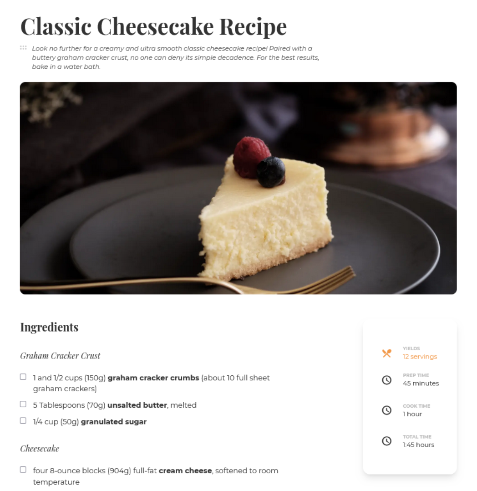

<!-- Please update value in the {}  -->

<h1 align="center">Interior Consultant - Dev Challenge</h1>

   Solution for a challenge from  <a href="http://devchallenges.io" target="_blank">Devchallenges.io</a>.

  <h3>
    <a href="http://dk-recipe-page.surge.sh/">
      Demo
    </a>
     | 
    <a href="https://github.com/Danak-UY/recipe-page">
      Solution
    </a>
     | 
    <a href="https://devchallenges.io/challenges/TtUjDt19eIHxNQ4n5jps">
      Challenge
    </a>
  </h3>

<!-- TABLE OF CONTENTS -->

## Table of Contents

- [Overview](#overview)
- [Built With](#built-with)
- [Features](#features)
- [UserStories](#user-stories)

<!-- OVERVIEW -->

## Overview

### Built With

<!-- This section should list any major frameworks that you built your project using. Here are a few examples.-->

- [TailwindCSS](https://tailwindcss.com/) - CSS Styling
- [Material Icons](https://developers.google.com/fonts/docs/material_icons) - Menu Icons

## Features

<!-- List the features of your application or follow the template. Don't share the figma file here :) -->

This application/site was created as a submission to a [DevChallenges](https://devchallenges.io/challenges) challenge. The [challenge](https://devchallenges.io/challenges/TtUjDt19eIHxNQ4n5jps) was to build an application to complete the given user stories.

## Acknowledgements

<!-- This section should list any articles or add-ons/plugins that helps you to complete the project. This is optional but it will help you in the future. For exmpale -->

- [Squoosh](https://squoosh.app/) - Optimize images with webp

## User Stories

- I can see a recipe with ingredients and instructions
- I can select a checkbox if I have the ingredients
- I can see the number of servings, baking times
